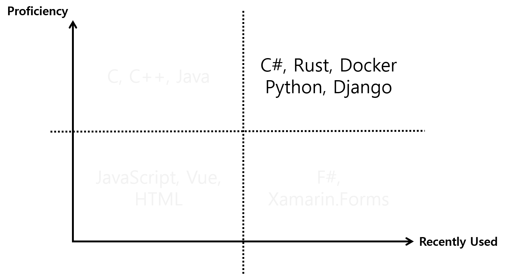

# Who am I?

### 20193052 Kangsu Kim (GSIS)

---

## Kangsu Kim

BS in Creative IT Engineering (POSTECH)

Interested in **almost all** security stuffs.

---

## What can I do?

---

## What can I do?

---

# Projects

---

## Interactive Projector

@css[tech-stack](**C#**, WinForms, Embedded Systems)

@css[project-desc](Camera attached projector with gesture control and screen manipulation with markers)

---

## xWorkspace

@css[tech-stack](**C#**, gRPC)

@css[project-desc](Shared Experience Platform based on Distributed Synchronization)

---

## study.plus.or.kr

@css[tech-stack](**Python**, **Django**)

@css[project-desc](Wargame / CTF platform for studying hacking techniques)

@snap[south project-comments]
Real instance running on: https://study.plus.or.kr 
This is an open source project, see: https://github.com/PLUS-POSTECH/study.plus.or.kr
@snapend

---

## Owl

@css[tech-stack](**Rust**)

@css[project-desc](Exploit management tool for attack and defense hacking competitions)

@snap[south project-comments]
This is an open source project, see: https://github.com/PLUS-POSTECH/Owl
@snapend

---

## Soma

@css[tech-stack](**Rust**, **Docker**)

@css[project-desc](Your one-stop CTF problem management tool)

@snap[south project-comments]
This is an open source project, see https://github.com/PLUS-POSTECH/Soma
@snapend
